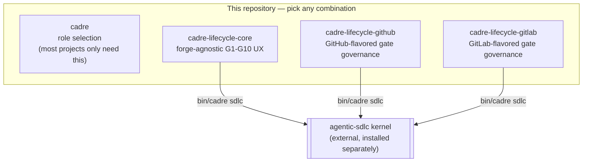

# Cadre Lifecycle

This repository packages **Cadre role selection** and **Agentic SDLC lifecycle governance** as 4 separate, independently-installable plugins from one source: `cadre` (role selection, the only one most projects need) plus 3 optional lifecycle-governance plugins, each self-sufficient and installable in any combination — none requires another.

## What This Is

This repository merges the role-selection capabilities of [Cadre](https://github.com/deagy/cadre) with the lifecycle governance of [Agentic SDLC](https://github.com/deagy/agentic-sdlc), and packages them as separate plugins rather than one bundle:



`cadre`, `cadre-lifecycle-core`, `cadre-lifecycle-github`, and `cadre-lifecycle-gitlab` are 4 separate plugin manifests — install only what you need. The 3 lifecycle plugins are each self-sufficient (no plugin requires another) and only become useful once the external `agentic-sdlc` kernel is installed (typically via one of their bundled bootstrap scripts — see "Lifecycle Governance with Agentic SDLC" below). Installing `cadre-lifecycle-core` alongside a forge plugin is redundant — both ship an onboarding/review/pending-gates skill set, namespaced distinctly by suffixed skill names — but harmless.

## Repository Layout

```
.                               # cadre plugin's own root
├── cline/                     # Cline plugin (agents_select tool call)
├── cline-agents/              # Cline plugin (71 Cadre role presets, dispatchable subagents)
├── bin/cadre                  # CLI dispatcher for role selection (and lifecycle, if installed)
├── agent-catalog.json         # Agent role catalog (generated)
├── provider.json              # Agentic SDLC provider bundle (referenced by plugins/lifecycle/)
├── profiles/                  # Profile definitions
├── extensions/                # Extension definitions
├── skills/                    # cadre plugin's own skills
├── agents/                    # Agent roles and policies
├── codex-agents/              # Codex CLI agent definitions
├── suite/roster/              # Catalog, routing, and orchestration source
│                               # (suite/roster/catalog.yaml, suite/roster/orchestration/src/select_agents.py)
├── tools/                     # Plugin versioning and utilities
├── .claude-plugin/            # cadre's Claude Code plugin manifest
├── .codex-plugin/             # cadre's Codex CLI plugin manifest
├── .agents/                   # Publishable skills
├── plugins/
│   ├── lifecycle/             # cadre-lifecycle-core plugin
│   │   ├── skills/            # lifecycle-onboarding, lifecycle-review, brief-pending-gates (register-generated)
│   │   └── tools/             # bootstrap_sdlc.py (hand-authored)
│   ├── lifecycle-github/      # cadre-lifecycle-github plugin (hand-authored)
│   └── lifecycle-gitlab/      # cadre-lifecycle-gitlab plugin (hand-authored)
└── package.json                # Workspace root
```

The G1–G10 Agentic SDLC kernel (`deagy/agentic-sdlc`) is an external dependency, not vendored in this repository — see "Lifecycle Governance with Agentic SDLC" below.

## Installing

Install `cadre` for role selection. Only add the lifecycle plugins if you actually want G1–G10 governance — most projects don't need them.

### Cline

Cline installs one plugin per repository clone/URL. The `agents_select` tool call belongs entirely to `cadre` (the lifecycle plugins are skill-only, no Cline tool), so there's nothing else to select here:

```sh
cline plugin install --git https://github.com/deagy/cadre-lifecycle --force
```

Or from a local checkout:

```sh
git clone https://github.com/deagy/cadre-lifecycle.git
cline plugin install /path/to/cadre-lifecycle --force
```

If `agents_select` doesn't show up after installing, restart the Cline hub daemon:

```sh
cline doctor fix
```

### Claude Code

Add this repository as a marketplace once (pin to a release tag), then install whichever plugins you want:

```text
/plugin marketplace add deagy/cadre-lifecycle@v0.7.0
/plugin install cadre@cadre-lifecycle-team

# Optional — only if you want forge-agnostic-only G1–G10 lifecycle governance:
/plugin install cadre-lifecycle-core@cadre-lifecycle-team

# Optional — install either or both independently if you want
# forge-specific gate-approval recording (each is self-sufficient):
/plugin install cadre-lifecycle-github@cadre-lifecycle-team
/plugin install cadre-lifecycle-gitlab@cadre-lifecycle-team
```

**Migrating from `cadre-lifecycle@cadre-lifecycle-team`** (the pre-0.3.0 combined plugin): uninstall it and install `cadre@cadre-lifecycle-team` instead — the rename is a new install key, not an automatic migration.

### Codex CLI

Clone at the tag first, add the marketplace once, then install whichever plugins you want:

```sh
git clone --branch v0.7.0 https://github.com/deagy/cadre-lifecycle.git
codex plugin marketplace add /path/to/cadre-lifecycle
codex plugin add cadre@cadre-lifecycle-team

# Optional, same conditions as above — each is self-sufficient and can be
# installed in any combination:
codex plugin add cadre-lifecycle-core@cadre-lifecycle-team
codex plugin add cadre-lifecycle-github@cadre-lifecycle-team
codex plugin add cadre-lifecycle-gitlab@cadre-lifecycle-team
```

## Using the `agents_select` Tool Call

The `agents_select` tool call provides deterministic agent dispatch from the Cadre catalog. It returns a plan (routes, primary/reviewer/support roles, quality gates) without invoking agents or mutating state. See [`cline/README.md`](cline/README.md) for full detail.

```typescript
// Example tool call
agents_select({
  task: "Implement user authentication with OAuth2",
  files: "src/auth/,tests/test_auth.py",
  base: "main",
  classification: "internal"
})
```

The tool call:
- Routes the task to appropriate specialist roles
- Identifies primary authors, independent reviewers, and support roles
- Defines quality gates and approval requirements
- Never invokes agents or makes lifecycle decisions

## Lifecycle Governance with Agentic SDLC

This section applies once at least one lifecycle plugin (`cadre-lifecycle-core`, `cadre-lifecycle-github`, and/or `cadre-lifecycle-gitlab`) is installed (see "Installing" above) — all three are optional, not part of the `cadre` plugin, and none is a prerequisite for the others.

For projects adopting the full G1–G10 lifecycle, install and configure the kernel with one opt-in command — use whichever lifecycle plugin(s) you actually installed; each bundles its own copy of the bootstrap script, and running any one of them is sufficient (none requires `cadre-lifecycle-core` to also be installed):

```sh
python3 plugins/lifecycle/tools/bootstrap_sdlc.py           # cadre-lifecycle-core
python3 plugins/lifecycle-github/tools/bootstrap_sdlc.py    # cadre-lifecycle-github
python3 plugins/lifecycle-gitlab/tools/bootstrap_sdlc.py    # cadre-lifecycle-gitlab

# all three accept the same flags, e.g.:
python3 plugins/lifecycle/tools/bootstrap_sdlc.py --dry-run              # report what would happen, change nothing
python3 plugins/lifecycle/tools/bootstrap_sdlc.py --root /path/to/project --profile secure-cloud
```

This `pipx install`s the exact kernel version `provider.json`'s `kernel_compatibility.minimum` currently declares, never touches an existing `agentic-sdlc` install that falls outside that range (it reports the mismatch and stops), and then runs `agentic-sdlc init` with this plugin's `provider.json`. It's deliberately a standalone script under each plugin's own `tools/`, not a `bin/cadre` subcommand — `bin/cadre` is fully regenerated by `deagy/cadre`'s `cadre generate-plugin` and would silently lose a hand-added case on the next sync.

If you have a real GitHub PR review or GitLab MR approval to cite for a gate decision, `cadre-lifecycle-github`/`cadre-lifecycle-gitlab` add that on top of (or instead of) `cadre-lifecycle-core` — their `lifecycle-review-github`/`lifecycle-review-gitlab` skills record it via `agentic-sdlc approve-from-github*`/`approve-from-gitlab*` instead of a generic evidence citation. The same two plugins also add `link-source-issue-<forge>` (record a G1/G2 source issue), `publish-gate-status-<forge>` (a one-way gate-status summary comment on the task's PR/MR), `report-gate-reviewers-<forge>` (read-only — which people would be asked to review, without actually requesting anything), and tracking-issue publishing per gate/approval (`gitlab-gate-tracking` on GitLab, `create-github-gate-issues` on GitHub). GitHub additionally gets `publish-reviewer-nudge-github`, an advisory PR comment (never a formal review request) suggesting who to ask.

Or drive the already-installed kernel directly:

```sh
# Initialize a project with the secure-cloud profile
agentic-sdlc init --root /path/to/project --profile secure-cloud

# Plan a task through the lifecycle
agentic-sdlc plan --task "Implement user authentication" --profile secure-cloud

# Validate gate readiness
agentic-sdlc validate --task <task-id>
```

The kernel's LangGraph engine drives tasks through the lifecycle as a compiled graph, with author/reviewer dispatch, gate sequencing, and separation-of-duties enforcement as graph control flow.

## Architecture

This project combines two independent upstream systems (see the diagram above for how the resulting 4 plugins relate):

| Component | Source | Responsibility |
|---|---|---|
| **Cadre Register** | [deagy/cadre](https://github.com/deagy/cadre) | Role definitions, catalog, routing (independent, not vendored) |
| **Agentic SDLC Kernel** | [deagy/agentic-sdlc](https://github.com/deagy/agentic-sdlc) | Lifecycle gates, run-record validation, gate authority (external dependency, not vendored) |

| Plugin | Summary | Skills |
|---|---|---|
| **`cadre`** | Role definitions/catalog/routing, and the `agents_select` Cline tool call (never talks to the lifecycle kernel). | — |
| **`cadre-lifecycle-core`** | Forge-agnostic lifecycle governance UX: conversational wrappers around `bin/cadre sdlc` (a thin pass-through to the external kernel), plus a local-only pending-gates briefing and the kernel bootstrap script. | `lifecycle-onboarding`, `lifecycle-review`, `brief-pending-gates` |
| **`cadre-lifecycle-github`** | GitHub-flavored gate governance: PR-review-sourced decisions, G1/G2 source-issue linking, gate-status PR comments, read-only PR-reviewer reporting, gate/approval tracking issues, and an advisory (never a formal request) reviewer nudge. Self-sufficient — bundles its own onboarding/review/pending-gates skills and kernel bootstrap. Requires `agentic-sdlc` [v0.12.0](https://github.com/deagy/agentic-sdlc/releases/tag/v0.12.0)+. | `lifecycle-onboarding-github`, `lifecycle-review-github`, `lifecycle-review-generic-github`, `brief-pending-gates-github`, `link-source-issue-github`, `publish-gate-status-github`, `report-gate-reviewers-github`, `create-github-gate-issues`, `publish-reviewer-nudge-github` |
| **`cadre-lifecycle-gitlab`** | GitLab-flavored gate governance: MR-approval-sourced decisions, G1/G2 source-issue linking, gate-status MR notes, read-only MR-reviewer reporting, and gate/approval tracking issues. Self-sufficient — bundles its own onboarding/review/pending-gates skills and kernel bootstrap. Requires `agentic-sdlc` [v0.12.0](https://github.com/deagy/agentic-sdlc/releases/tag/v0.12.0)+. | `lifecycle-onboarding-gitlab`, `lifecycle-review-gitlab`, `lifecycle-review-generic-gitlab`, `brief-pending-gates-gitlab`, `link-source-issue-gitlab`, `publish-gate-status-gitlab`, `report-gate-reviewers-gitlab`, `gitlab-gate-tracking` |

The Cadre register remains the source of truth for role definitions, and (as of this split) also generates `cadre-lifecycle-core`'s three skills into `plugins/lifecycle/skills/` — see `cadre-ref.txt`. `cadre-lifecycle-github`/`cadre-lifecycle-gitlab` are entirely hand-authored here; the register has no concept of them, including their bundled onboarding/review/pending-gates skill copies, which are hand-maintained duplicates of `cadre-lifecycle-core`'s register-generated skills kept in sync via `tools/test_plugin_duplication_health.py`. Assets in this repository are generated from the register — see "Regenerating Assets" below for the safe procedure; `cadre generate-plugin --output` cannot be run directly against this repository.

## Development

### Running Tests

```sh
# Cline plugin tests (cadre)
cd cline && npm test

# Cline Agents plugin tests (71 Cadre role presets)
cd cline-agents && npm test
cd cline-agents && npm run typecheck

# Plugin versioning/release tooling tests (cadre)
python3 -m unittest discover -s tools -p "test_*.py" -v

# cadre-lifecycle-core's bootstrap script tests
python3 -m unittest discover -s plugins/lifecycle/tools -p "test_*.py" -v

# cadre-lifecycle-github's and cadre-lifecycle-gitlab's own bundled bootstrap-script copies
python3 -m unittest discover -s plugins/lifecycle-github/tools -p "test_*.py" -v
python3 -m unittest discover -s plugins/lifecycle-gitlab/tools -p "test_*.py" -v
```

### Regenerating Assets

**`cadre generate-plugin --output` is not safe to run directly against this repository.** The register (`deagy/cadre`) split its own downstream plugin distribution out into a separate repository at some point before this repository's pinned `cadre-ref.txt` revision — originally `deagy/cadre-plugin`, now archived and superseded by this repository — and its generator writes `README.md` from a template (`packaging/plugin-README.md`) describing a different, single-plugin `cadre`/`agentic-sdlc` structure with its own versioning and install instructions, not this repository's actual merged Cadre + Agentic SDLC + Cline identity split across 4 plugins. That template now names `deagy/cadre-lifecycle` as its own "this repository" row, since it was updated to point at the current successor, but its *structure* still describes the old single-plugin shape — the register has no concept of this repository's 4-plugin split at all.

Everything else the register generates (`skills/`, `agents/`, `codex-agents/`, `suite/`, `agent-catalog.json`, `bin/cadre`, `profiles/`, `extensions/`, and — as of the plugin split — `plugins/lifecycle/skills/`) is role/routing content, not repository-identity prose, so it stays correct. Hand-authored exceptions, never touched by regeneration:

- `README.md` (despite `cadre-ref.txt` naming a generated-content revision) — the original exception.
- `plugins/lifecycle/.claude-plugin/`, `plugins/lifecycle/.codex-plugin/`, `plugins/lifecycle/tools/` — this sub-plugin's own manifests and bootstrap script; only its `skills/` is register-generated.
- `plugins/lifecycle-github/`, `plugins/lifecycle-gitlab/` entirely — the register has no concept of these plugins at all.

To refresh generated assets from the Cadre register safely:

```sh
git clone https://github.com/deagy/cadre.git
git -C cadre checkout "$(grep -v '^[[:space:]]*#' /path/to/cadre-lifecycle/cadre-ref.txt | grep -v '^[[:space:]]*$' | head -1)"
cadre/bin/cadre generate-plugin --output /tmp/cadre-lifecycle-regen   # a scratch directory, never this checkout directly
diff -rq /tmp/cadre-lifecycle-regen /path/to/cadre-lifecycle          # review the diff
```

Apply everything **except `README.md`** from that diff, bump `cadre-ref.txt` to the new revision, and re-run repository health checks before committing. The diff should never propose changes under `plugins/lifecycle-github/`, `plugins/lifecycle-gitlab/`, or `plugins/lifecycle/{.claude-plugin,.codex-plugin,tools}/` — if it does, something is wrong (the register should never have touched those paths).

If the diff touches `plugins/lifecycle/skills/{lifecycle-onboarding,lifecycle-review,brief-pending-gates}/`, manually re-apply the same content changes to the renamed bundled copies in `plugins/lifecycle-github/skills/` (`lifecycle-onboarding-github`, `lifecycle-review-generic-github`, `brief-pending-gates-github`) and `plugins/lifecycle-gitlab/skills/` (`lifecycle-onboarding-gitlab`, `lifecycle-review-generic-gitlab`, `brief-pending-gates-gitlab`), preserving each copy's forge-specific frontmatter `name`/`description` and any cross-reference sentence differences. Then re-run `tools/test_plugin_duplication_health.py` to confirm no drift remains.

## Releasing

Version lives in all 8 plugin manifests (4 plugins × `.claude-plugin/plugin.json` + `.codex-plugin/plugin.json`) and is shared across all of them — one release bumps every plugin together. Bump them together:

```sh
python3 tools/plugin_version.py --set 0.3.0
```

Pushing that bump to `main` triggers [`.github/workflows/release.yml`](.github/workflows/release.yml), which tags the commit (`vMAJOR.MINOR.PATCH`) and publishes a GitHub Release with that version's `CHANGELOG.md` entry as its notes. Don't tag or create the Release by hand for a version bump landing on `main` — the workflow does it (and is idempotent: it checks whether the tag already exists before doing anything, so a re-run or an accidental manual tag is a safe no-op, not a duplicate).

See [Releases](https://github.com/deagy/cadre-lifecycle/releases) or [CHANGELOG.md](CHANGELOG.md) for the full history. Recent highlights:

- [v0.7.0](https://github.com/deagy/cadre-lifecycle/releases/tag/v0.7.0) — Make `cadre-lifecycle-github`/`-gitlab` self-sufficient: each bundles its own onboarding/generic-review/pending-gates skills and kernel bootstrap script, no longer requiring `cadre-lifecycle-core`
- [v0.6.0](https://github.com/deagy/cadre-lifecycle/releases/tag/v0.6.0) — Add `brief-pending-gates` (local-only, forge-agnostic pending-gate briefing); tighten context-reuse wording across all 11 forge skills
- [v0.5.0](https://github.com/deagy/cadre-lifecycle/releases/tag/v0.5.0) — Add 3 skills: GitHub gate-issue tracking, an advisory (non-request) reviewer nudge, and read-only GitLab reviewer-candidate reporting

## License

Apache-2.0 — see [LICENSE](LICENSE) for details.
