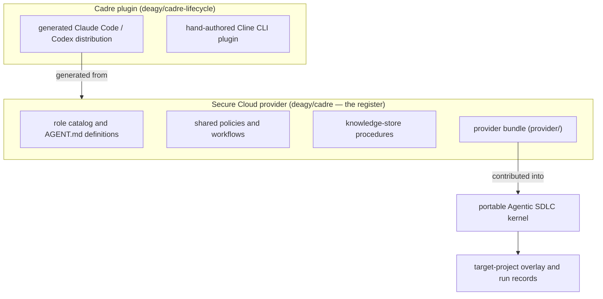

<!-- GENERATED FILE: edit the canonical source and regenerate; do not edit this copy. -->

# Terminology

This is this repository's glossary of recurring domain terms. Where a term
has a fuller worked example elsewhere in the docs, the link goes there; where
it names a concrete field or file, the link goes to that source instead.

| Term | Meaning |
| --- | --- |
| Agent definition | The canonical `AGENT.md` describing one role's purpose, inputs, authority, escalation conditions, and completion criteria. See the [role index](role-index.md) for all 71. |
| Catalog | [`roster/catalog.yaml`](../roster/catalog.yaml), the machine-readable inventory of role IDs, definition paths, phases, capability tiers, model tiers, and reasoning effort. See the [capability index](capability-index.md) for a browsable view. |
| Capability tier | The class of change authority a role has, recorded as `catalog.yaml`'s `capability` field: `read_only`, `document_author`, `code_author`, `test_author`, or `environment_operator`. See the [capability index](capability-index.md) for every role grouped by tier, and each role's own `AGENT.md` "Authority" section for its exact scope. |
| Reasoning effort | A shared per-role value in `catalog.yaml` (`low`/`medium`/`high`) propagated into both generated wrappers — Claude Code's `effort:` frontmatter and Codex's `model_reasoning_effort` — so one field drives both runners. Tied to the same fixed heuristic as the role's model tier (`catalog.yaml`'s header comment): `opus`→`high`, `sonnet`→`medium`, `haiku`→`low`. |
| Provider | A package that supplies roles, profiles, and extensions to the portable Agentic SDLC kernel. |
| Provider repository | A distribution project that supplies provider resources and dispatch inputs to other consuming projects. Being a provider is orthogonal to being a lifecycle consumer: a provider repository may optionally also run its own `.agentic-sdlc/` overlay and run records to track its own roadmap (this one does not), without that overlay carrying any authority over another project's gates. |
| Profile | A selectable lifecycle configuration that combines a kernel baseline with project-relevant roles and defaults. |
| Workflow | A documented sequence for a class of work, such as a new service, debugging, release, or incident. See `roster/workflows/` and the [orchestration guide](orchestration.md). |
| Route | One entry in [`roster/orchestration/routing.yaml`](../roster/orchestration/routing.yaml)'s `routes[]` array: a set of file-path patterns and/or keywords mapped to primary/reviewer/support roles and required quality gates. A task matches zero, one, or several routes; `cadre select` reports the matches as `matched_routes`. See the [sample selection output](sample-selection-output.md) for a worked example. |
| Risk rule | One entry in `routing.yaml`'s `risk_rules[]` array (for example `authentication-authorization`, `sensitive-data`, `database-migration`): keyword/path triggers that add reviewers, quality gates, or a required human gate on top of whatever routes already matched, independent of route matching. Reported as `matched_risks` in a `cadre select` plan. |
| Team recipe | One entry in `routing.yaml`'s `team_recipes[]` array: a deterministic rule that groups already-selected roles into a named team (`type: "fixed"`, e.g. `cross-stack-build`) or a dynamic role/instance-count range (`type: "dynamic"`, e.g. the competing-hypotheses debugging recipe) once a route/keyword trigger condition is met. Never adds a role that wasn't already independently selected. See [team-recipes.md](../../skills/run-agent-orchestration/references/team-recipes.md) for the named compositions and the [sample selection output](sample-selection-output.md) for a triggered example. |
| Dispatch plan | A reviewable `cadre select` output identifying matched routes/risks, primary/reviewer/support roles, teams, workflow, required and human gates, and planned knowledge-context retrieval — never execution, approval, or mutation. See [`roster/orchestration/selection.schema.json`](../roster/orchestration/selection.schema.json) for the authoritative schema and [sample selection output](sample-selection-output.md) for an annotated real example. |
| Run record | The project-owned record of lifecycle state, decisions, evidence, approvals, and invalidations. |
| Quality gate | A lifecycle checkpoint (G1–G10) requiring defined criteria and evidence before progression; a dispatch plan's `required_quality_gates`/`ignored_quality_gates` fields report which apply. Gate semantics, state, and per-gate author/reviewer fan-out belong to the Agentic SDLC kernel/LangGraph engine, not the dispatch plan (schema v3 dropped the earlier `gate_dispatch` field, which only ever carried a hardcoded default). |
| Human gate | A decision reserved for an accountable human, such as risk acceptance, policy exception, production authorization, or release approval; reported in a dispatch plan's `human_gates` field when a matched route or risk rule requires one, each entry carrying a `kernel_mutation_gate_id` cross-reference to the Agentic SDLC kernel's own `contracts/mutation-gates.json` id where one exists. |
| Independent reviewer | A role that evaluates an exact revision separately from its author and cannot approve its own work. |
| Provenance | The chain of evidence tying a piece of retrieved or generated content back to its origin. In the knowledge store, preserved per citation as `source`, `conversation_id`, `message_id`, `chunk_id`, `content_hash`, `created_at`, and `classification`; the underlying `source_uri` is retained in the database for steward provenance but omitted from ordinary retrieval output by default because it may expose a local path. See [`roster/knowledge-store/README.md`](../roster/knowledge-store/README.md) and [`roster/knowledge-store/SECURITY.md`](../roster/knowledge-store/SECURITY.md). |
| Knowledge focus | Per-role guidance text in `routing.yaml`'s `knowledge_focus` block (and each role's own `AGENT.md` frontmatter) describing what kind of prior context that role should retrieve from the knowledge store for a task — for example, a cloud-architect's focus is "prior architecture decisions, constraints, alternatives, failure domains, and recovery objectives." Generated from `AGENT.md` frontmatter by `roster/orchestration/src/generate_role_metadata.py`; never hand-edit `routing.yaml`'s copy directly. Surfaced per selected agent in a dispatch plan's `knowledge_context.requests[].query`. |
| Generated artifact | A runner or package file produced from canonical source; it is regenerated rather than edited by hand. |
| Platform | An external organization/platform whose impact-category and BOM (SBOM/CBOM/QBOM/AI-BOM/Trust-BOM/Time-BOM) semantics this repository deliberately does not define — see `roster/shared/platform-impact-profile.yaml`. A consuming project must supply its own authorized definitions and owners before treating any category as applicable; `unknown` blocks the relevant gates by design, not by omission. |

## Relationship between the three repositories

The kernel owns lifecycle state and gate transitions, permanently — no
provider ever takes over schema, validator, or gate-authority ownership. This
repository owns the Secure Cloud provider content but does not run its own
`.agentic-sdlc/` overlay. Every consuming target project owns only its own
overlay and run records; none carries authority over another's. A provider or
agent cannot grant itself human authority.
