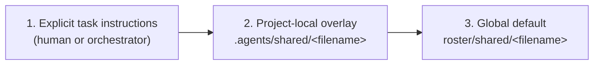

<!-- GENERATED FILE: edit the canonical source and regenerate; do not edit this copy. -->

# `roster/shared/` — global defaults and per-project overrides

Every role's `AGENT.md` points at a subset of the files in this directory as
required reading (stack choices, autonomy policy, security baseline, and so
on), and `roster/orchestration/src/generate_global_plugin.py` embeds them
directly into every packaged role's instructions. Those files are this
repository's **global defaults**. A project using these agents can extend or,
where it makes sense, override them without editing this checkout, by
placing a same-named file at `.agents/shared/<filename>` in its own tree.

## Optionality and PII

Every file in this directory is optional as a global default: a project (or
this repository itself) may have no `team-profile.yaml` at all, or an emptied
one, and nothing should crash or hard-fail because of that -- roles proceed on
task-brief judgment when a shared file is absent, and
`generate_global_plugin.py` simply omits an absent file's section from the
generated wrappers rather than failing.

`generate_global_plugin.py` embeds these files **verbatim** into every one of
the 71+ generated role wrappers (both the Codex `.toml` wrappers committed in
this repository and the Claude Code wrappers written into the separately
published public `cadre-lifecycle` repository). Because of that, files under
`roster/shared/` must never contain personal names, emails, or other
individual-identifying data. Named human approval or escalation-contact
information (who is a project's Product Owner, on-call contact, etc.) belongs
in a consuming project's own local/untracked config or its `agentic-sdlc`
lifecycle records -- never here.

## Precedence



Highest precedence wins per file. The overlay is found by walking up from
the current directory to the nearest `.git` (the same convention
`roster/knowledge-store/src/config.py` uses for its project-local
`config.json`). Resolve the effective value with `cadre resolve-shared
<filename>` (see `roster/shared/src/resolve.py`), run from anywhere inside
the target project. It fails closed: a malformed overlay is an error, not a
silent fallback to the default.

## Merge rule by file type

- **Structured files** (`*.yaml`, `*.json` — `team-profile.yaml`,
  `library-standards.yaml`, `agent-autonomy.yaml`,
  `control-mapping-template.yaml`, `platform-impact-profile.yaml`): deep-merged,
  overlay wins per key. Keys the overlay doesn't mention keep the global
  default.
- **`agent-autonomy.yaml` specifically**: the merge is narrowing-only. This
  file is a safety control, not a preference, so a project overlay may move
  a value toward *more* restrictive (e.g. `allowed` → `human_approval`) but
  resolving raises an error if an overlay tries to loosen a `never` default
  or turn any other restricted default into `allowed`. An overlay also can't
  touch `policy_version` or `default_rule` (the fixed contract) or reference
  a key the global default doesn't define.
- **Prose files** (`*.md` — `operating-principles.md`,
  `technology-standards.md`, `cloud-guardrails.md`,
  `secure-development-policy.md`, `risk-severity-model.md`,
  `knowledge-use-policy.md`, `definition-of-done.md`, `workspace-isolation.md`):
  additive, never replaced. If an overlay exists, the resolved text is the
  global default plus an appended `## Project addendum` section. On a direct
  conflict between the default and the addendum, the more specific/restrictive
  instruction wins, per the existing rule in `operating-principles.md`.

### Tier-scoped shared policies

Most files in this directory are embedded into *every* generated role
wrapper (`SHARED_POLICIES` in `generate_global_plugin.py`). A smaller set is
embedded only into wrappers for capability tiers the file names, via
`TIER_SCOPED_POLICIES` in the same module — currently just
`workspace-isolation.md`, scoped to `WRITE_CAPABLE_TIERS` (every capability
tier whose `sandbox_mode` in `roster/runner-capabilities.json` is not
`read-only`; a read-only role has no edits to isolate). A tier-scoped file
still follows the same missing/emptied/present optionality rule as any
`SHARED_POLICIES` file for the tiers it applies to, and still opens with an
explicit applicability header naming those tiers, because the scoping below
is generated-wrapper-only.

**This scoping applies only to the generated wrapper, not to
`cadre resolve-shared`.** `resolve.py` is filename-based and knows nothing
about capability tiers, so running `cadre resolve-shared
workspace-isolation.md` from a read-only role (or from any shell) still
returns the file's full resolved text — the tier gate only decides whether
`generate_global_plugin.py` embeds the section into a *specific role's*
generated wrapper instructions. That asymmetry is why every tier-scoped
file must state its own applicability in its own text: `cadre
resolve-shared` cannot do that filtering for it.

## Where overlays live

```
<project-root>/
└── .agents/
    └── shared/
        ├── team-profile.yaml          # overrides roster/shared/team-profile.yaml
        ├── agent-autonomy.yaml        # narrowing-only overrides
        └── technology-standards.md    # appended as a project addendum
```

Only files a project actually wants to extend or override need to exist
under `.agents/shared/`; anything absent resolves straight to the global
default.

### The three things that live under `.agents/`

`.agents/` hosts three separate project-local mechanisms. They look alike
and are **not** interchangeable — each has its own resolver, merge rule,
and, most importantly, its own trust posture. Read the trust column before
adding anything here.

| Path | What it is | Trust | Merge |
| --- | --- | --- | --- |
| `.agents/shared/<filename>` | Policy overlays — this document | **Trusted.** Alters agent policy; `agent-autonomy.yaml` is narrowing-only so an overlay can tighten but never loosen autonomy. | Deep-merged over the global default (`resolve.py`) |
| `.agents/knowledge-store/config.json` | Knowledge-store configuration | Security-relevant. Its *presence* selects the project-local tier, which gates database confinement, prohibits remote embeddings, and changes `--source` enforcement. | Own three-tier resolver (`knowledge-store/src/config.py`) |
| `.agents/cadre.yaml` (or `.json`) | Operator settings — endpoints, binary paths, store location | **Untrusted.** Arrives with `git clone` and is editable by anyone who can open a pull request. Fields that select an executable, a data-store location, or a token-receiving destination are `global_only` and are rejected outright if set here. | First-wins precedence, no merging (`shared/src/settings.py`) |

The asymmetry is deliberate. A policy overlay can only ever *narrow* what
agents may do, so trusting it is safe. An operator setting picks which
binary gets executed and where a service token is sent, so a file that
travels with a repository must not be able to choose it — see
`roster/RUNBOOK.md`'s configuration section for the full trust-scope table
and the reasoning behind each `global_only` field.

`.agents/knowledge-store/config.json` is deliberately **not** folded into
`.agents/cadre.yaml`: only its `home` directory is an operator setting, and
that one field now resolves through `settings.py` as a lower-precedence
fallback beneath `KNOWLEDGE_STORE_HOME`. The rest of that file is store
schema, and its tier detection is load-bearing security state that a second
resolver must not perturb.

## Generating overlays with `cadre init`

Rather than hand-authoring `.agents/shared/<filename>` overlays from scratch,
run `cadre init --target <project-root>` (see
`roster/shared/src/init_project.py`) for a guided walkthrough of three
sections (`--sections` restricts to a comma-separated subset; default: all):

- **RG-A** — stack/tooling opinions.
- **RG-B** — governance/autonomy narrowing, via a closed allowlist for
  `agent-autonomy.yaml` (never free text).
- **RG-C** — guided `platform-impact-profile.yaml` fill-in.

Key behavior:

- Nothing is written without `--force` (omitting it previews only), and every
  generated overlay is validated by resolving it exactly as `cadre
  resolve-shared` would before success is reported.
- Answer the run either non-interactively with `--answers <file.yaml>`
  (`schema_version: 1`, documented in `init_project.py`'s module docstring —
  the same shape `--print-answers` echoes back, so a prior run is directly
  reusable) or interactively with `--interactive` (exactly one is required).
  `--stack <preset-id>` names a static, human-reviewed, RG-A-only starter
  preset from `roster/shared/init-presets/*.yaml` (never touches
  `agent-autonomy.yaml` or `cloud-guardrails.md`) as interactive defaults or
  an `--answers` merge base (the answer file's own values win).
- `--print-answers` echoes the resolved, validated answer set for
  reproducibility; `agent-autonomy.yaml`/`cloud-guardrails.md` fields are
  redacted there to an `accepted`/`rejected` status plus a sha256 hash — the
  raw value is never printed, only ever written to the audit log or the
  resulting overlay file.
- `technology-standards.md` and `cloud-guardrails.md` overlays use a managed
  block (`<!-- agents-init:managed:start/end -->`): reruns accumulate new
  entries there (deduping exact duplicates) without touching content a human
  added outside the block.
- Every answered field needs a `field_decisions` entry
  (`kept`/`overridden`/`deferred` status, plus a `stack` or `governance`
  category); `cadre init` fails closed (no writes) on a missing decision or a
  category that doesn't match the field's actual file.

## The platform impact profile

`platform-impact-profile.yaml` defines the impact-category and BOM vocabulary for
an external organization/platform this repository deliberately does not
define the semantics of (see `docs/terminology.md`'s platform entry) — a
consuming project supplies its own authorized definitions and owners, and
`unknown` blocks the relevant gates by design in whatever system enforces
that lifecycle (this repository's own run-record/quality-gate machinery was
intentionally removed in favor of the standalone Agentic SDLC kernel; see
`bin/cadre sdlc`). A project overlay of this file follows the same
structured-file merge rule as any other shared default — it can pre-fill a
project's own applicability decisions as a starting template, not just leave
every category `unknown`.
