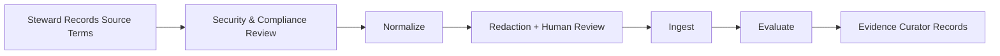

<!-- GENERATED FILE: edit the canonical source and regenerate; do not edit this copy. -->

# Knowledge Store Ingestion Workflow

This workflow carries no lifecycle gate — authorization comes from the
Security/Compliance reviewers and the Knowledge Store Steward's own
operator authority (`roster/knowledge-store/AGENT.md`), not a numbered
`G1`-`G10` human gate.

1. Knowledge store steward records source ownership, processing authority, intended use, classification, retention, residency, deletion, tenant, and audience constraints.
2. Security and compliance reviewers assess sensitive-data handling and external embedding-provider restrictions before real content leaves the staging boundary.
3. Store steward normalizes recognized export fields and samples results against the source. The generic parser does not validate or preserve every canonical-schema field; add a source-specific adapter when fidelity matters.
4. Run redaction and prompt-injection detection. Human-review representative samples and every unexpected sensitive-data category.
5. Ingest into a store partition whose access controls match the source classification. The demo response includes run ID and message/chunk counts; keep parser version, exact embedding provider/model/dimensions, configuration, redaction summary, and approvals in a supplemental steward record.
6. Evaluate retrieval with representative questions, negative access tests, stale/conflicting guidance tests, and citation verification. Preserve evaluated bundles and their integrity hashes because re-ingestion can change content under existing identifiers.
7. Evidence curator records approvals and ingestion evidence without copying raw sensitive content.
8. Remove raw staging exports through the approved records process. Record retention/deletion obligations separately; the demo has no lifecycle commands or automated deletion evidence.

Do not ingest when ownership, consent/authority, classification, provider data-use terms, residency, retention, or deletion obligations are unresolved.
