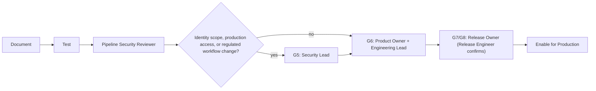

<!-- GENERATED FILE: edit the canonical source and regenerate; do not edit this copy. -->

# Pipeline Change Workflow

Gate set cross-checked against `routing.yaml`'s `pipeline` route (`G5, G6, G7, G8`) and `roster/authority/aides.yaml`.

1. CI/CD engineer documents the execution graph, trust boundaries, runner types, triggers, permissions, secret exposure, artifact flow, environments, and rollback behavior.
2. Test changes with non-production identities and synthetic inputs. Include untrusted merge-request/fork scenarios where applicable.
3. Pipeline security reviewer independently checks injection paths, token scope, runner persistence, cache/artifact poisoning, mutable dependencies, provenance, signatures, protections, approvals, and audit evidence.
4. Code or infrastructure reviewers join when scripts, build logic, deployment modules, runners, or cloud resources change.
5. Security/compliance review is required when identity scope, production access, evidence generation, retention, or regulated workflows change.
6. Release engineer confirms protections and approvals before enabling the pipeline for production.

Never expose production secrets to untrusted code, reuse a build identity for deployment, promote a different artifact than the reviewed build, or bypass gates by changing trigger context.
