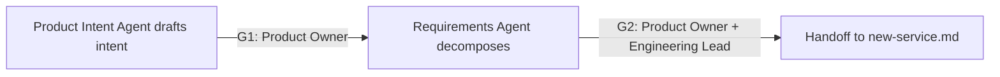

<!-- GENERATED FILE: edit the canonical source and regenerate; do not edit this copy. -->

# Product Intake Workflow

Use this workflow when work has not yet entered architecture or implementation.

1. Dispatcher records scope, classification, human owner, exclusions, source references, and authorized knowledge-retrieval status.
2. Product Intent Agent drafts a versioned intent record covering users, outcomes, scope, exclusions, constraints, environments, and measurable success criteria. It does not set priority, resolve mission ambiguity, or approve intent.
3. Human Product Owner resolves conflicts, sets priority, and approves or rejects G1.
4. Requirements Agent decomposes approved intent into stable requirement IDs, acceptance criteria, dependencies, non-functional requirements, controls, tests, evidence obligations, trace links, and downstream gate applicability.
5. Governance Planner, Data Governance Engineer, and Cryptographic Assurance Engineer provide early applicability input and a fail-closed platform impact profile without inventing undefined semantics.
6. Human Product Owner and Engineering Lead approve or reject G2.
7. On approval, hand off the immutable intent and requirements baseline, traceability graph, platform profile, open findings, and evidence hashes to `new-service.md`. Objective conflicts return to G1.

Neither agent may approve, prioritize, cancel, accept risk, or make a persistent
environment change. Missing ownership, conflicting objectives, or unknown
applicable platform semantics block the handoff.
